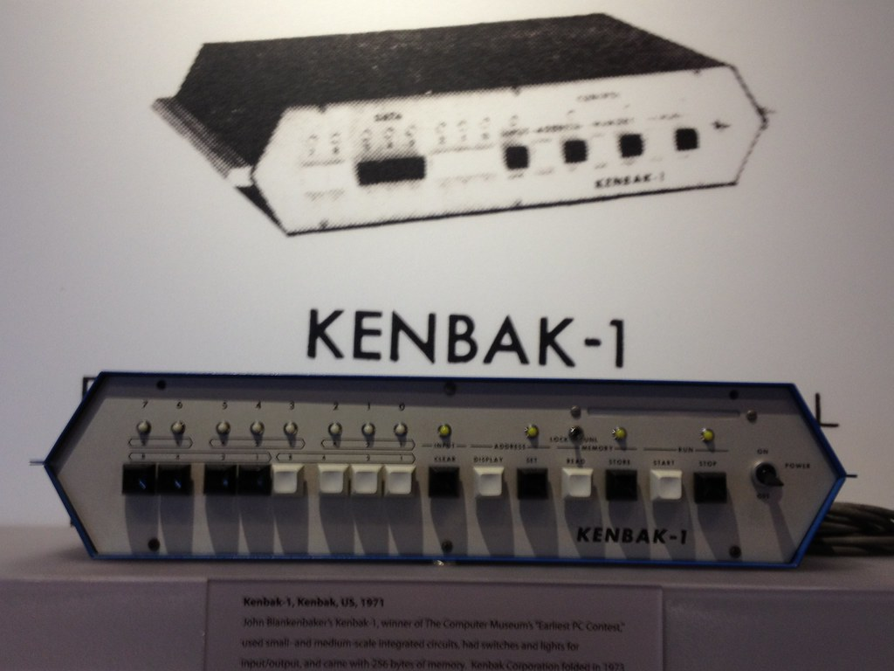

# kenbak--1 fan page
the Kenbak-1 was a true stored-program computer that offered 256 bytes of memory, a wide variety of operations and a speed equivalent to nearly 1MHz.The Kenbak-1 was designed before the first microprocessor, hence its sole basis was small-scale integration TTL chips rather than a single chip for the CPU. The 8-bit computer used Intel's type 1404A silicon gate MOS shift registers to implement its 256 bytes of memory.
Designed in 1971, before microprocessors were invented, the Kenbak-1 had 256 bytes of memory and featured small and medium scale integrated circuits on a single circuit board. 
Since the Kenbak-1 was invented before the first microprocessor, the machine didn't have a one-chip CPU but was instead based purely on small-scale integration TTL chips.
A Kenbak-1 at the Computer History Museum
Developer	John Blankenbaker
Manufacturer	Kenbak Corporation
Type	Personal computer
Release date	1971

MacBook Air M2 (2022)
1.1GHz quad-core Intel Core i5, Turbo Boost up to 3.5GHz, with 6MB L3 cache. 
Apple MacBook Air M2 (2022) Specs. The base model has an eight-core CPU and eight-core GPU, 8GB of RAM, and 256GB of storage, while the $1,499 step-up model that I have been able to test comes with a 10-core GPU and 512GB of storage. 
16GB or 24GB unified memory. 512GB, 1TB, or 2TB SSD. 35W Dual USB-C Port Compact Power Adapter. 70W USB-C Power Adapter.
| mackbook air m2        |kenbal-1           
| ------------- |:-------------:| 
| apple m1     | Intel's type 1404A  
| 8b memory ram    | 256 bytes memory      
| 253 GB storage | 256 bytes      |    $

https://www.youtube.com/watch?v=IoScmIoeAr4 video about **kenbak-1**
https://www.apple.com/jo/ 
1. kenbak-1
2. mackbook air 
⋅⋅* Unordered sub-list. 
1. microsoft computers

